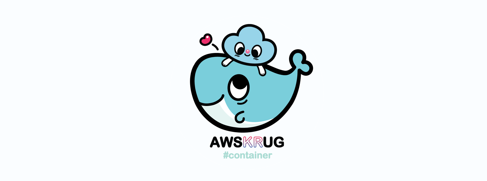

# container-group

안녕하세요! AWSKRUG 컨테이너 소모임입니다.

2018년 4월부터, AWSKRUG 컨테이너 소모임은 AWS와 클라우드 컴퓨팅에 관심 있는 분들중에서도, 특히 컨테이너 관련 서비스-도커-에 관심있는 분들이 모여서 서로 지식과 정보를 교류하는 시간을 가지고 있습니다. 한달에 한번씩 컨테이너 관련된 주제로 자신의 경험, 공부한 내용 등을 공유합니다. 

<strong><u>공유해주시는 분들께는 $100의 AWS 크레딧이 제공됩니다.</u></strong>

***#Docker #ECS #EKS #Fargate #Kubernetes***

# Links
- AWSKRUG facebook : https://www.facebook.com/groups/awskrug/
- AWSKRUG meetup : https://www.meetup.com/ko-KR/awskrug/
- AWSKRUG blog : http://www.awskr.org/
- AWSKRUG slack : http://awskrug.slack.com
- AWSKRUG slack 가입 : http://www.awskr.org/slack/

# Organizer
- 김현민
- 우여명
- 유정렬
- 류한진

# 소모임 이력
- [2018년 소모임](meetups/2018.md)
