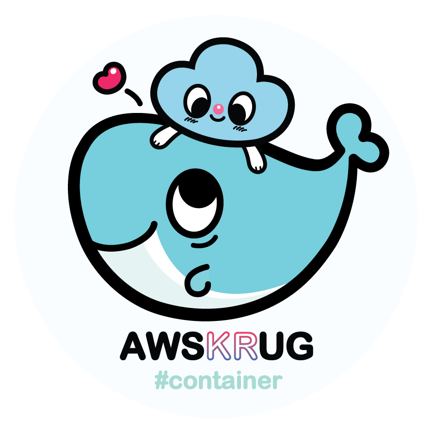

# [container-group :whale:](https://awskrug.github.io/container-group/)



안녕하세요! `AWSKRUG 컨테이너 소모임` 블로그 저장소입니다.

`AWSKRUG 컨테이너 소모임`은 컨테이너를 다루고 운영하는 기술에 대해서 함께 토론하고 공유하는 소모임입니다.

## 포스팅 및 퍼블리싱
이 블로그는 `hugo`라는 도구를 이용해서 포스트를 작성하고 퍼블리싱합니다. 따라서 `hugo` 설치가 필요합니다.

- https://gohugo.io/getting-started/installing/

테마는 `Spectre Pixel`입니다.

- https://themes.gohugo.io/hugo-spectre-pixel-theme/

### 1. 글 작성

`content/posts` 디렉토리에 markdown 형식으로 포스트를 작성합니다.

### 2. 빌드

```sh
hugo -D
```
위 명령어로 빌드하면 `content` 디렉토리 하위의 markdown 컨텐츠들이 `docs` 디렉토리에 html 파일로 변환되어 저장됩니다.

### 3. 배포
master 브랜치로 푸시하게 되면 `docs` 디렉토리의 컨텐츠들이 github 페이지로 배포됩니다.


## Links
- [AWSKRUG 컨테이너 소모임 블로그](https://awskrug.github.io/container-group/)
- [AWSKRUG 컨테이너 소모임 소개](https://awskrug.github.io/container-group/about)
- [AWSKRUG facebook](https://www.facebook.com/groups/awskrug/)
- [AWSKRUG meetup](https://www.meetup.com/ko-KR/awskrug/)
- [AWSKRUG blog](http://www.awskr.org/)
- [AWSKRUG slack](http://awskrug.slack.com)
- [AWSKRUG slack 가입](http://www.awskr.org/slack/)